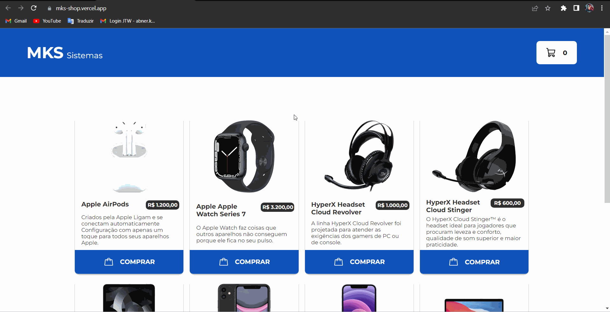

# Mks Shop

## Funcionalidades:
- Adicionar um item ao carrinho, modificar sua quantidade e fazera compra do item.

## Descrição:
- Esse é um projeto desenvolvido como um desafio pessoal, onde funciona como um e-commerce com suas funções principais, como adicionar um item ao carrinho, mudar a quantidade deste item e comprar um item.
- O projeto é desenvolvido com styled-components onde visa em tornar mais simples a estilização dos components pela mudança de estado.
- Utiliza a biblioteca Zod para validação de formulários.
- Usa a context API para compatilhar os estados entre components, como por exemplo passar os estados dos ciclos para a página History listar os ciclos com seus estados atuais.
- Utiliza a Reack-hook-forms para gerenciar os estados de dados no formulário

## Apresentação do Pojeto:

## Gostou do meu projeto? :D Entre em contato comigo! 
- [Linkedin](https://www.linkedin.com/in/abner-santos-b195b8228/)  
- [Email: abner.kif1@gmail.com](mailto:abner.kif1@gmail.com)
- 
